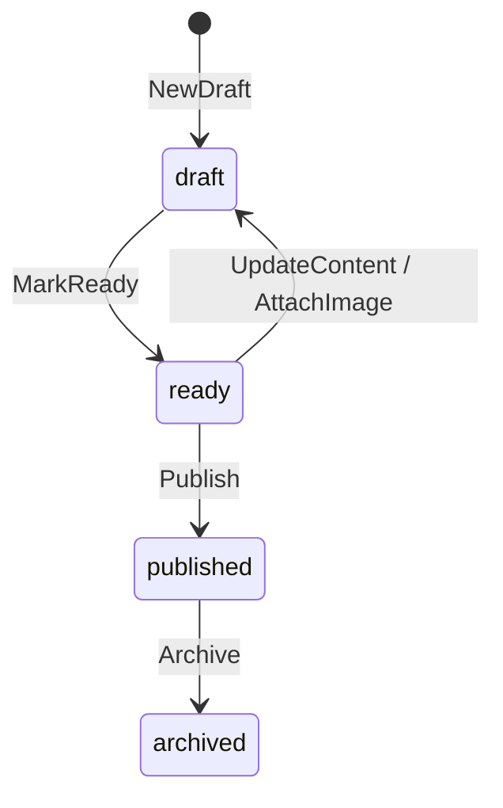

# RFC 0001: Доменное поведение статьи

- Статус: Proposed
- Дата: 2026-08-20
- Область: импорт, подготовка и публикация новостей
- Автор решения: maintainers Neuro News

## Резюме

Статья становится доменным агрегатом, который защищает правила создания, подготовки и публикации. Код вне агрегата не должен напрямую менять состояние статьи.

Изменение внедряется поэтапно. Первый этап добавляет поведение и тесты поверх текущего монолита. Он не требует переписывания приложения, микросервисов или новой очереди.

## Контекст

Текущая `Article` — структура данных с открытыми полями. Любой пакет может создать неполную статью, присвоить ей неверный идентификатор изображения или сохранить её без проверки. Модель также смешивает:

- доменные данные статьи;
- поля представления сайта;
- детали хранения в MySQL;
- признаки разных типов контента через поле `kind`;
- запросы конкретных блоков главной страницы.

Из-за этого правила распределены между grabber, service и repository. Компилятор не защищает допустимые состояния, а тесты не могут проверить поведение статьи отдельно от инфраструктуры.

## Цели

1. Сосредоточить правила статьи в одном месте.
2. Запретить недопустимые переходы состояния.
3. Разделить доменную модель, сценарии приложения и чтение для сайта.
4. Сохранить текущий монолит и внедрять изменения небольшими PR.
5. Сделать правила исполняемой спецификацией через unit-тесты.

## Не входит в RFC

- микросервисы;
- брокер сообщений и распределённые события;
- новый frontend;
- замена MySQL;
- универсальный framework для всех сущностей;
- полная переработка импорта за один PR;
- редакторская админ-панель.

## Термины

| Термин | Значение |
| --- | --- |
| Статья | Новостной материал, который проходит подготовку и публикацию |
| Черновик | Статья, ещё не готовая для публичного показа |
| Готовая статья | Полная и проверенная статья, которую можно опубликовать |
| Опубликованная статья | Статья, доступная публичным запросам |
| Архивная статья | Снятая с публичного показа статья |
| Источник | Сайт и исходный URL импортированного материала |
| Медиа | Изображение или другое вложение, связанное со статьёй |
| Задание импорта | Технический процесс получения и обработки внешнего материала |

## Решение

### 1. Граница агрегата

`Article` — корень агрегата. Он отвечает за:

- основные данные материала;
- редакционный статус;
- связь с главным изображением;
- время создания и публикации;
- проверку переходов состояния.

Изображение остаётся отдельной сущностью. Статья хранит типизированный `MediaID`, но не управляет файлом и генератором изображений.

Ошибки загрузки страницы, парсинга и генерации изображения относятся к `ImportJob`. Статус `failed` не является состоянием статьи: техническая ошибка задания не должна искажать редакционный жизненный цикл материала.

### 2. Состояния статьи

| Состояние | Смысл | Публично доступно |
| --- | --- | --- |
| `draft` | Материал создан или редактируется | Нет |
| `ready` | Все условия публикации выполнены | Нет |
| `published` | Материал опубликован | Да |
| `archived` | Материал снят с публикации | Нет |



Разрешены только переходы на диаграмме. Повторная публикация, публикация черновика и изменение архивной статьи должны возвращать доменную ошибку.

В первой версии опубликованная статья неизменяема. Исправления опубликованного материала и управление версиями требуют отдельного RFC.

### 3. Поведение агрегата

Агрегат предоставляет следующие операции. Названия описывают контракт, а не обязательные Go-сигнатуры.

#### `NewDraft`

Создаёт черновик из импортированных или введённых данных.

Правила:

- статус всегда `draft`;
- идентификатор БД не принимает вызывающий код;
- время создания передаёт application layer через `Clock`;
- количество комментариев начинается с нуля;
- тип материала не передаётся произвольной строкой.

Черновик может не иметь preview и изображения. Заголовок, содержимое, источник и исходный URL обязательны уже при создании, потому что без них импорт не имеет полезного результата.

#### `UpdateContent`

Меняет заголовок, preview, содержимое, категорию или slug.

Правила:

- разрешено для `draft` и `ready`;
- изменение `ready` возвращает статью в `draft`;
- запрещено для `published` и `archived`;
- операция повторно проверяет изменённые value objects.

#### `AttachImage`

Связывает статью с сохранённым медиафайлом.

Правила:

- `MediaID` должен быть положительным и принадлежать существующему медиа;
- разрешено для `draft` и `ready`;
- замена изображения у `ready` возвращает статью в `draft`;
- идентификаторы статьи и изображения имеют разные типы;
- repository не меняет `MediaID` после вставки статьи.

Проверку существования медиа выполняет application service до вызова агрегата. Агрегат проверяет форму идентификатора и допустимость перехода.

#### `MarkReady`

Подтверждает готовность статьи к публикации.

Операция разрешена только для `draft`. Для успеха требуются:

- непустой заголовок;
- непустой preview;
- непустое содержимое;
- корректный slug;
- категория;
- источник и исходный URL;
- главное изображение;
- содержимое, прошедшее установленную политику очистки HTML.

#### `Publish`

Переводит `ready` в `published` и устанавливает `PublishedAt`.

Правила:

- публикация из любого другого состояния запрещена;
- время публикации не может быть нулевым или раньше времени создания;
- публичные запросы возвращают только `published`;
- повторный вызов возвращает доменную ошибку и не меняет объект.

#### `Archive`

Переводит `published` в `archived`.

Архивная статья исчезает из публичных списков и прямого публичного URL, но остаётся в базе. Физическое удаление не входит в этот RFC.

### 4. Инварианты и value objects

| Значение | Правило |
| --- | --- |
| `ArticleID` | Отдельный тип; после сохранения больше нуля |
| `MediaID` | Отдельный тип; нельзя присвоить `ArticleID` |
| `Title` | После trim не пустой, не длиннее 300 символов |
| `Preview` | Обязателен для `ready`, не хранит исполняемый HTML |
| `Body` | После trim не пустой; создаётся только из безопасного содержимого |
| `Slug` | Непустой lowercase slug; глобально уникален в первой версии |
| `Category` | Непустое нормализованное значение, не длиннее 100 символов |
| `SourceURL` | Абсолютный HTTP/HTTPS URL; уникален для дедупликации |
| `CreatedAt` | Не нулевой, задаётся один раз |
| `PublishedAt` | Заполнен только у опубликованной или архивной статьи |
| `Status` | Только одно из четырёх объявленных состояний |

Внешний HTML очищается на границе импорта. Домен принимает специальное безопасное значение `Body`, а не произвольную строку, которую presentation layer позднее преобразует в доверенный HTML.

### 5. Доменные ошибки

Вызывающий код должен различать как минимум:

- нарушение обязательного поля;
- некорректный value object;
- недопустимый переход состояния;
- отсутствие главного изображения;
- конфликт slug;
- дубликат исходного URL;
- конфликт версии при конкурентном обновлении.

Домен не логирует ошибки. Он возвращает их application layer. Логирование выполняется один раз на внешней границе: HTTP handler или worker.

### 6. Application use cases

Первый набор сценариев:

| Use case | Ответственность |
| --- | --- |
| `ImportLatestArticle` | Получить внешний материал, проверить дедупликацию, создать draft |
| `GenerateArticleImage` | Создать и сохранить медиа, затем прикрепить его к draft |
| `PrepareArticle` | Вызвать `MarkReady` после успешного обогащения |
| `PublishArticle` | Опубликовать ready-статью в транзакции |
| `ArchiveArticle` | Снять опубликованную статью с показа |

Текущий автоматический режим может последовательно вызвать import, image generation, prepare и publish. Явные переходы сохраняют правила и позже позволят добавить редакторское подтверждение без изменения домена.

### 7. Порты и направления зависимостей

Домен не импортирует HTTP, SQL, шаблоны, grabber, Kandinsky или logger.

Минимальные порты application layer:

- `ArticleRepository`: получить статью по ID, сохранить агрегат, проверить исходный URL;
- `MediaRepository`: проверить и сохранить метаданные медиа;
- `SourceReader`: получить данные внешней статьи;
- `ImageGenerator`: создать изображение;
- `Clock`: предоставить текущее время;
- `TransactionManager`: выполнить согласованное сохранение.

Запросы `carousel`, `trending`, `home` и `pagination` не входят в доменный repository. Их обслуживает отдельный read/query service, который возвращает DTO для шаблонов.

### 8. Хранение данных

Изменение оформляется новой миграцией `002`; существующую `001_initial_up.sql` не редактировать.

Предлагаемые поля таблицы `article`:

| Поле | Назначение |
| --- | --- |
| `status` | Редакционный статус |
| `source_url` | Исходный URL и ключ дедупликации |
| `source_name` | Название источника |
| `published_at` | Время публикации |
| `version` | Оптимистическая блокировка |

Миграция выполняется по схеме expand–migrate–contract:

1. Добавить новые nullable-поля и `version` со значением 1.
2. Назначить существующим статьям статус `published` для сохранения текущего поведения сайта.
3. Заполнить доступные данные источника.
4. Перевести новые импорты на `draft`.
5. Добавить фильтр `status = 'published'` во все публичные запросы и счётчики.
6. После backfill добавить ограничения `NOT NULL` и уникальный индекс `source_url`.
7. Добавить уникальный индекс для slug после проверки существующих дублей.

`Save` обновляет запись с условием `WHERE article_id = ? AND version = ?`. Ноль изменённых строк означает конфликт конкурентного обновления.

Сохранение медиа и статьи выполняет application use case. Данные MySQL сохраняются в транзакции. Для файла или внешнего object storage применяется компенсация: при ошибке транзакции новый файл удаляется либо помечается для фоновой очистки.

### 9. Размещение кода

Целевая структура:

```text
internal/
  domain/article/          Article, статусы, value objects, доменные ошибки
  application/article/     use cases и порты
  adapters/mysql/article/  persistence model и реализация repository
  adapters/http/           handlers и DTO представления
```

Переход выполняется постепенно. Сначала можно добавить поведение рядом с текущей моделью, затем отделить persistence DTO и перенести домен. Пустой новый слой, который нигде не используется, создавать нельзя.

## Рассмотренные альтернативы

### Оставить структуру данных и проверять всё в service

Отклонено. Правила продолжат дублироваться, а любой пакет сможет обойти проверки прямым присваиванием полей.

### Сразу переписать проект на полный DDD

Отклонено. Большой rewrite усложнит проверку изменений и смешает исправление ошибок с новой архитектурой.

### Выбранный вариант: постепенная богатая модель

Каждый PR добавляет одно проверяемое поведение и подключает его к одному реальному use case. Старый путь удаляется только после успешной интеграции.

## План реализации

### PR 1. Характеризация текущего импорта

- Зафиксировать тестами существующий успешный путь.
- Добавить regression-тесты для пустых данных и перепутанных ID.
- Не менять публичное поведение.

### PR 2. Создание черновика

- Добавить value objects для обязательных значений.
- Добавить `NewDraft`.
- Перевести grabber на DTO и создание статьи через use case.
- Оставить persistence model отдельно от доменной модели.

### PR 3. Медиа и готовность

- Добавить тип `MediaID` и `AttachImage`.
- Добавить `MarkReady` и тесты предусловий.
- Исправить атомарность сохранения метаданных изображения и статьи.

### PR 4. Жизненный цикл публикации

- Добавить миграцию `002`.
- Реализовать `Publish` и `Archive`.
- Ограничить публичные запросы статусом `published`.
- Добавить оптимистическую блокировку.

### PR 5. Разделение чтения и записи

- Перенести UI-запросы в query service.
- Оставить доменному repository только операции с агрегатом.
- Удалить зависимости application layer от HTTP и шаблонов.

## Стратегия тестирования

### Unit-тесты домена

- создание валидного и невалидного draft;
- каждый разрешённый переход;
- каждый запрещённый переход;
- условия `MarkReady`;
- публикация с корректным временем;
- запрет перепутать `ArticleID` и `MediaID` на этапе компиляции;
- неизменность объекта после неуспешной операции.

### Тесты application layer

- orchestration импорта без HTTP и MySQL;
- дедупликация по `SourceURL`;
- транзакционная последовательность сохранения;
- отсутствие публикации после ошибки генерации изображения;
- обработка конфликта версии.

### Интеграционные тесты

- миграция чистой и существующей базы;
- round-trip агрегата через MySQL repository;
- уникальность `source_url` и slug;
- публичные запросы не возвращают draft, ready и archived;
- rollback при ошибке сохранения статьи.

## Критерии приёмки

RFC считается реализованным, когда:

1. Новый материал создаётся только через доменную операцию.
2. Публичной может стать только статья в состоянии `ready`.
3. Черновики и архивные статьи отсутствуют во всех публичных выборках и счётчиках.
4. Ошибка импорта не переводит статью в выдуманный редакционный статус `failed`.
5. Дубликат исходного URL не создаёт вторую статью.
6. ID статьи нельзя случайно присвоить изображению без явного преобразования.
7. Параллельные обновления не затирают друг друга молча.
8. Домен не зависит от HTTP, SQL, шаблонов, логгера и AI-провайдеров.
9. Основные правила покрыты unit- и integration-тестами.
10. Миграция сохраняет доступность существующих опубликованных статей.

## Развёртывание и откат

Развёртывание выполняется только после резервной копии БД и проверки миграции на копии данных.

Порядок выпуска:

1. применить расширяющую миграцию;
2. выпустить код, который понимает старые и новые записи;
3. выполнить backfill;
4. включить новые ограничения;
5. проверить публичные страницы и worker;
6. удалить старый путь создания статьи в следующем релизе.

Для отката приложение временно возвращается к чтению всех старых опубликованных записей. Миграция отката не должна удалять заполненные `source_url`, `status` и `published_at` до подтверждения стабильности предыдущей версии.

## Риски

| Риск | Снижение риска |
| --- | --- |
| Существующие статьи исчезнут из выдачи | Backfill `published` до включения фильтра |
| Дубли не позволят создать уникальный индекс | Отчёт и ручное разрешение дублей до constraint |
| Новый домен будет обходиться старым кодом | Переводить по одному use case и удалять старый путь в том же PR |
| Файл сохранится без записи в БД | Компенсация или фоновая очистка orphaned media |
| Одновременные workers перезапишут статью | Поле `version` и optimistic locking |
| RFC превратится в большой rewrite | Ограничить каждый PR одним вертикальным поведением |

## Открытые вопросы

Перед PR 4 владелец продукта должен подтвердить:

1. Нужна ли ручная редакторская проверка или worker публикует `ready` автоматически?
2. Обязательно ли изображение для всех категорий статей?
3. Должен ли публичный URL включать категорию или slug остаётся глобально уникальным?
4. Как показывать архивную статью по старой внешней ссылке: `404`, `410` или редирект?
5. Разрешены ли исправления опубликованного материала без создания новой версии?

До ответа применяются рекомендации RFC: автоматическая публикация после `MarkReady`, обязательное изображение, глобально уникальный slug, ответ `410` для архива и запрет изменения опубликованной статьи.
